# Flashing ESPNOW

This page will guide you through flashing your SlimeVR trackers and dongle to support ESPNOW.

## Table of Contents

- TOC
{:toc}

## Flashing Firmware to Trackers

In order to allow ESPNOW communications, it is necessary to flash new firmware to your trackers. Flashing firmware is similar to the process of updating your trackers in the SlimeVR Server application. ESPNOW firmware updating is not built into the SlimeVR Server, so you will need to manually flash your trackers.

**DISCLAIMER: This firmware is not a part of the official SlimeVR firmware yet. Make sure you understand the risks before proceeding with flashing the firmware.**

There is pre-compiled tracker firmware available to use. You will need to download the correct firmware for your specific tracker version. To find out which version you have, open up your tracker and look at the text printed on the circuit board (PCB) inside — it should indicate the version number (for example, "v1.0" or "v1.2").

Download the tracker firmware that matches your version:

* v1.0: [Tracker Firmware (untested)](https://github.com/ReSummit/SlimeVR-Tracker-ESP/releases/download/v0.7.2_ESPNOW/BOARD_SLIMEVR-firmware.bin)
* v1.2: [Tracker Firmware (untested)](https://github.com/ReSummit/SlimeVR-Tracker-ESP/releases/download/v0.7.2_ESPNOW/BOARD_SLIMEVR_V1_2-firmware.bin)

Other tracker firmware builds can be found below (temporary while the official builds don't exist yet):  
https://github.com/ReSummit/SlimeVR-Tracker-ESP/releases/tag/v0.7.2_ESPNOW

NOTE: For all other tracker builds, please instead download the source code from the repository below and compile manually. Follow the instructions in the DIY Builder's Guide for uploading the tracker firmware, but use the repository linked below. **When setting up the environment, follow the instruction on step 4 regarding clicking the Source Control button and select the esp-now branch (WITH the hyphen)**:  
[https://github.com/mitzey234/SlimeVR-Tracker-ESP/tree/esp-now](https://github.com/mitzey234/SlimeVR-Tracker-ESP/tree/esp-now)

For official trackers, we will use over-the-air (OTA) to flash. This method requires the tracker to be connected to WiFi. The WiFi network should be the same one your computer is connected to. If you have not set this up, please follow tthe [Quick Setup](https://docs.slimevr.dev/quick-setup.html) guide.

### OTA Flashing

**IMPORTANT: Make sure your trackers have enough battery charge before flashing. If a tracker loses power during a flash, the update may not finish properly and could leave the tracker in a broken state. It is recommended to fully charge your trackers or keep them plugged in while flashing.**

**Before beginning this step, make sure you turn off SlimeVR! If it is minimized, find SlimeVR in the tray area of your computer. Right click on the icon and press "Exit".**

To do OTA flashing, you will need to download the OTA flash tool. You can find the one for your OS below:

* Windows: [SlimeVR-OTA-GUI_win-x64.zip](https://github.com/ButterscotchV/SlimeVR-OTA-CLI/releases/download/v0.3.1/SlimeVR-OTA-GUI_win-x64.zip)
* Linux: [SlimeVR-OTA-GUI_linux-x64.zip](https://github.com/ButterscotchV/SlimeVR-OTA-CLI/releases/download/v0.3.1/SlimeVR-OTA-GUI_linux-x64.zip)

Extract the downloaded file into a new folder and open the executable inside. You should see the interface below:  
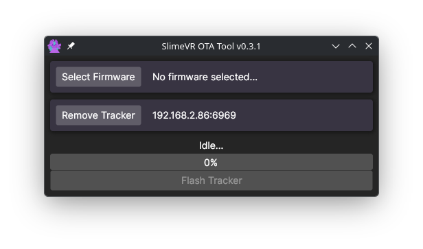

Press the "Select Firmware" Button to open a file selection dialog. Select the firmware you downloaded from the [Flashing Firmware](#flashing-firmware-to-trackers) step.

Turn on **1 singular tracker** and observe that you see a set of numbers on the 2nd row representing your tracker.  

Note: When flashing your trackers, ensure that you only have one tracker on at the same time! Make sure to keep track of which trackers have been flashed already.

Once you confirm both, you can press the "Flash Tracker" button. Be patient as it will take some time for the tracker to be flashed.  
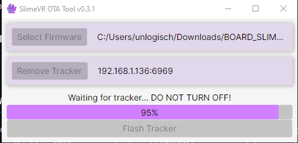

**WARNING: DO NOT TOUCH THE TRACKER DURING THE FLASH AND 10 SECONDS AFTER COMPLETION.**

After waiting for the confirmation that the flash is complete, as well as waiting 10 seconds, you can turn off and on the tracker. 

When you turn on the tracker, ensure you see a stable blue light from the tracker that remains on for aroudn 2 seconds. If this happens, you successfully flashed the tracker and can turn it off for now.

Repeat the flashing process for additional trackers.

**I see the window below during a OTA flash, what do I do?**  
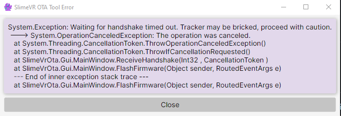

Unfortunately, this means the tracker was not able to be flashed over OTA. This can happen for a number of reasons, such as the tracker losing connection to WiFi during the flash or the tracker's battery running low. You will need to flash your tracker using a USB cable instead.

### Recovering Tracker Firmware via USB

If OTA flashing fails, you will need to flash the tracker by connecting it directly to your computer with a USB cable instead. The SlimeVR docs have a guide that walks you through this process, including how to open up your tracker and put it into flash mode for your specific PCB revision:

[Updating Firmware — SlimeVR Docs](https://docs.slimevr.dev/updating-firmware.html)

Follow the **USB recovery (serial flashing)** instructions on that page. Once your tracker is recovered, you can try the OTA process again with the ESPNOW firmware you downloaded from the [Flashing Firmware](#flashing-firmware-to-trackers) step.

## Flashing Firmware to the Dongle

Your dongle also needs firmware in order to receive data from your trackers. The SlimeVR ESP Dongle Manager has a built-in tool that handles downloading and flashing the dongle firmware for you.

### Connecting the Dongle

Plug the dongle into your computer using a USB cable. If your dongle has two USB ports, check the underside of the board — connect using the port labeled "COM".  
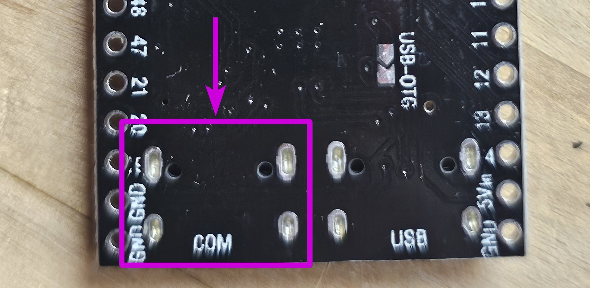

Open the SlimeVR ESP Dongle Manager. If this is a brand new dongle that has never been flashed, the application may say "No Devices Detected" at the top. However, you should see a link that says "Show 1 hidden devices" below it. Click on that link to reveal the dongle.

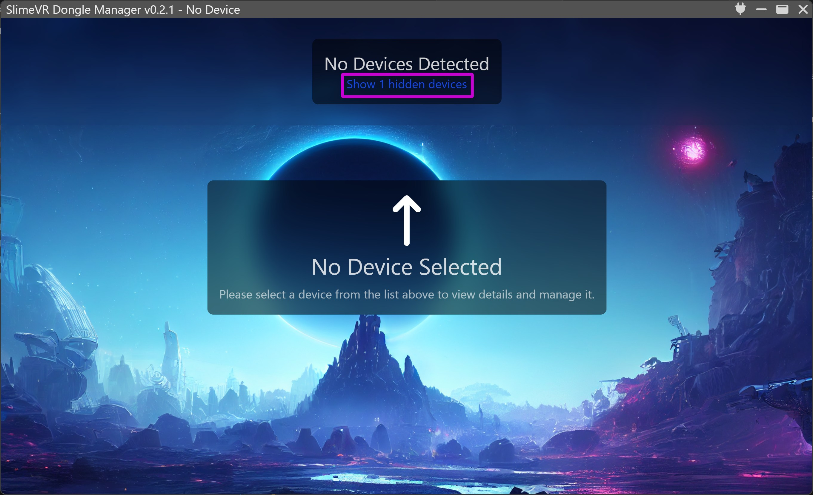

After clicking, the dongle will appear in the top left area as "Unknown Device". Select it by clicking on it.

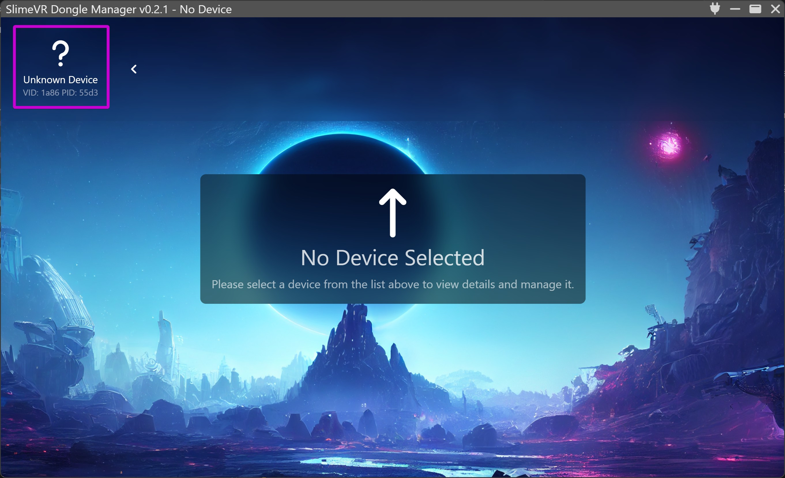

Once selected, you will see a "Connect to port" button. Press it to connect to the dongle.

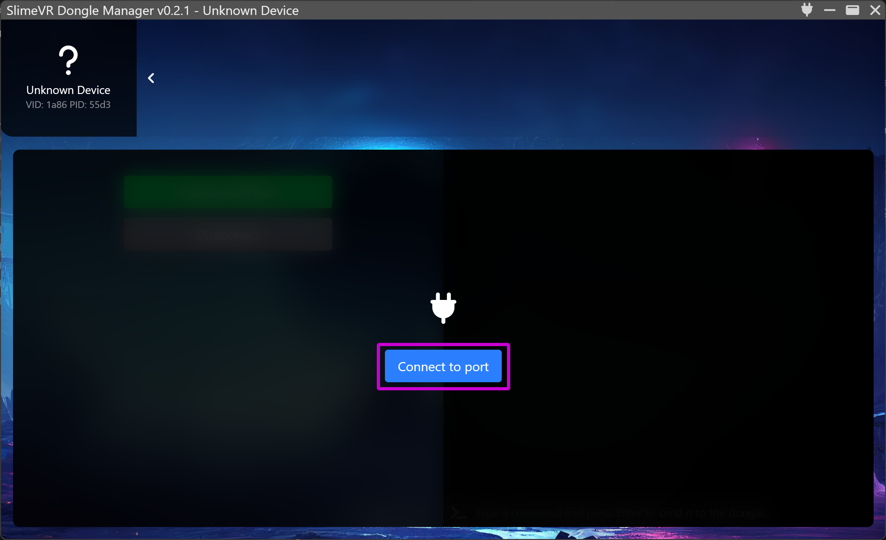

### Connecting ESPTool

After connecting to the port, you will see a green "Connect ESPTool" button on the left side. Press this button. The application will attempt to communicate with your dongle — this may take a moment.

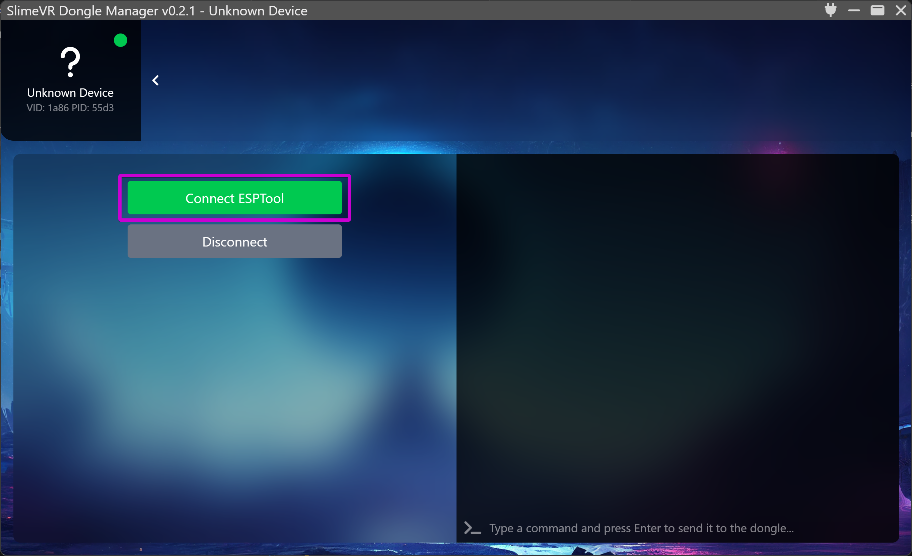

If the connection fails, make sure the dongle is properly plugged in and try again. If it still does not work, try a different USB cable — some cables only carry power and do not transfer data.

### Flashing the Dongle Firmware

After ESPTool connects successfully, you will see a set of new buttons appear. Press the purple "Dongle Firmware Flash" button.

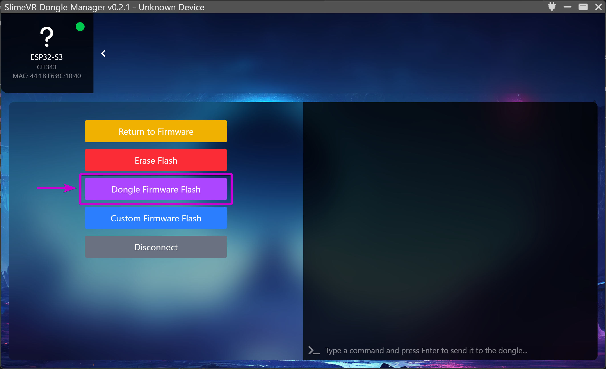

A window will appear titled "Select device board". From the list, find and select the board that matches your dongle hardware (for example, "SlimeVR Dongle S3" or "Seeed Studio XIAO ESP32S3"). If you are unsure which board you have, check the text printed on your dongle's circuit board.

You can also select which firmware version to use from the dropdown in the top right corner. By default, the latest version will be selected.

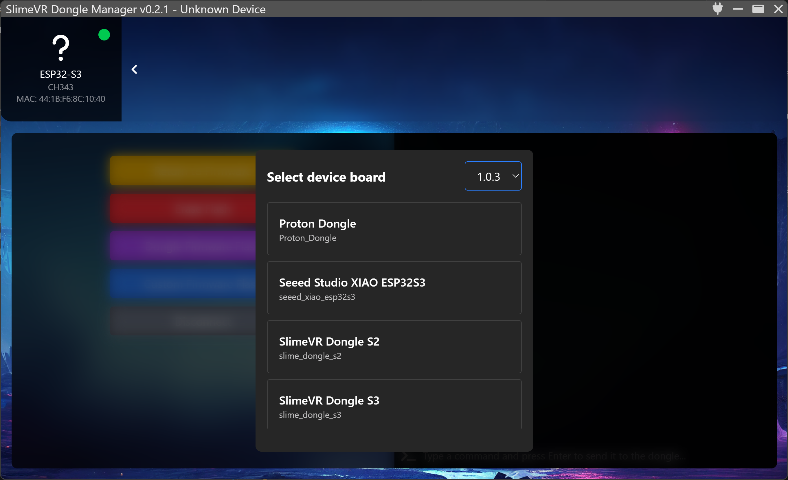

Once you have selected your board, press the "Confirm" button.

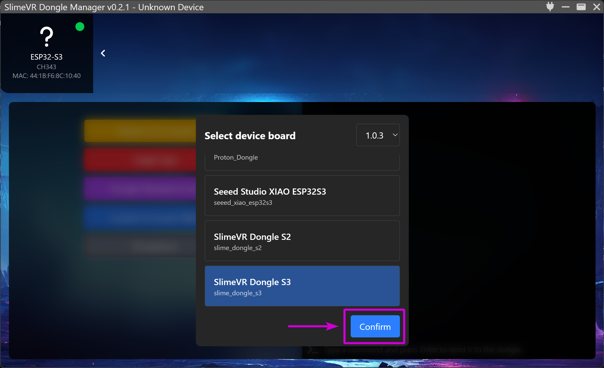

The application will download the firmware and begin flashing your dongle. You will see a list of files being written along with a progress bar for each one.

**WARNING: Do not disconnect the dongle or close the application during flashing.**

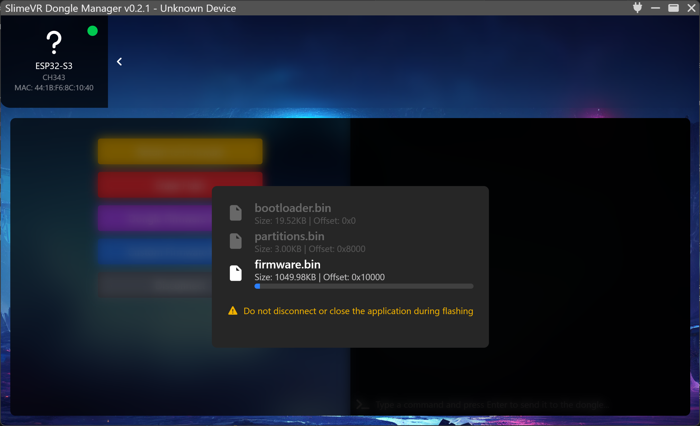

Once all files have finished flashing, the dongle will be ready to use.

## Next Steps

Once you have flashed your dongle and trackers, you may proceed to [Pairing ESPNOW Trackers](./02-Pairing_ESPNOW_Trackers.md).