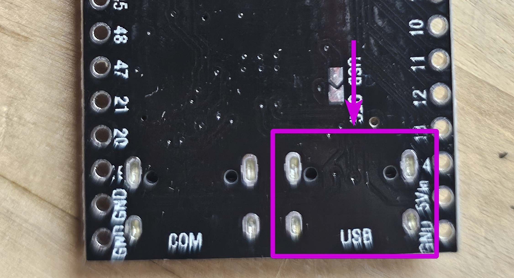
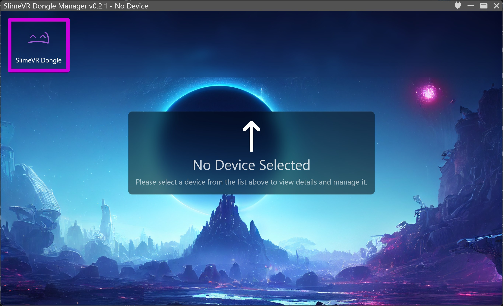
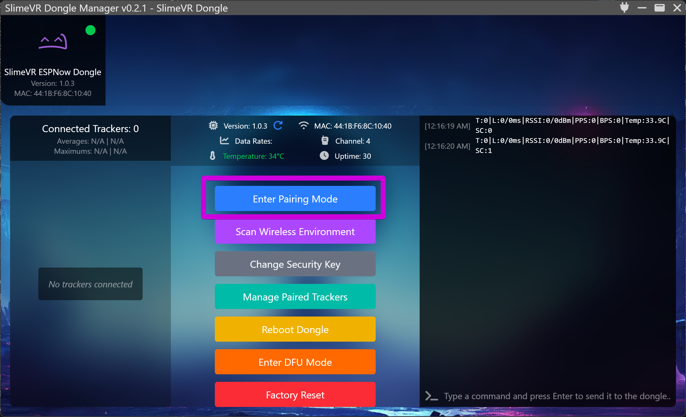
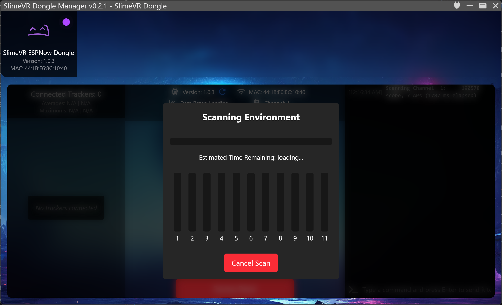
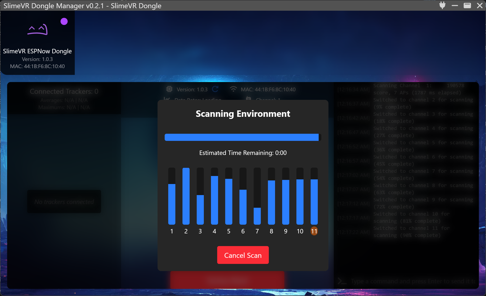
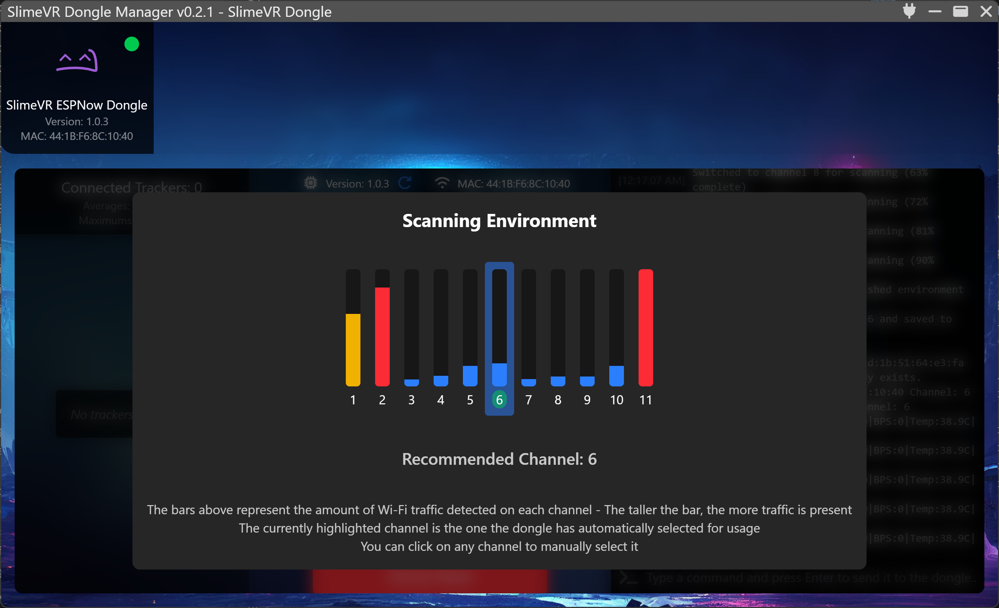
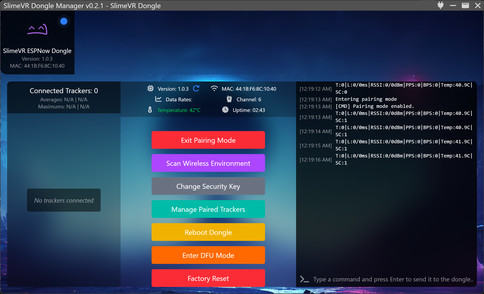
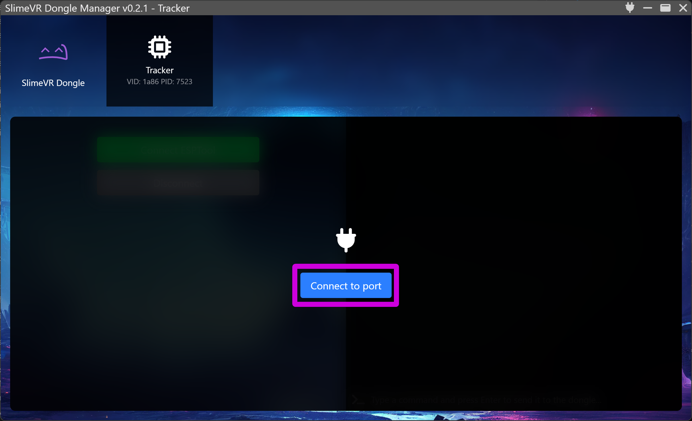
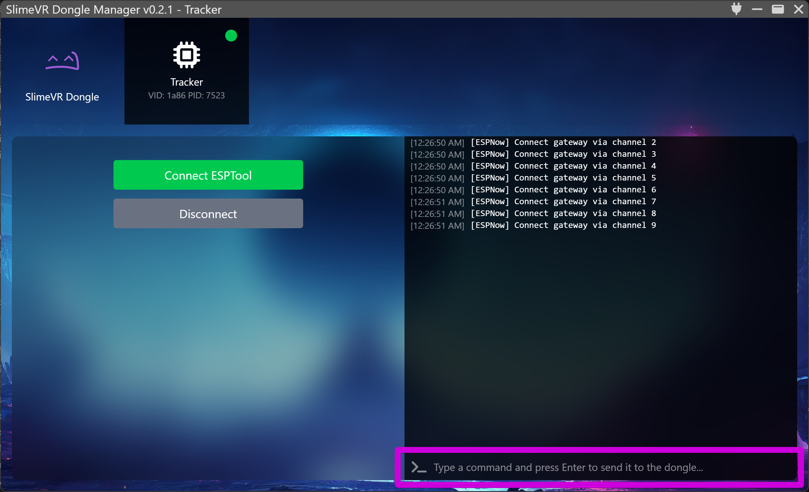
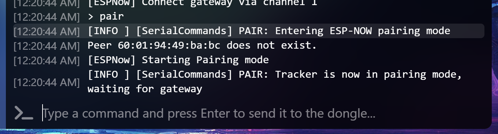

# Pairing SlimeVR ESPNOW Trackers

This page will guide you through the "slimevr-esp-dongle-manager" program and go through the pairing procedure to connect your trackers to the dongle.

## Table of Contents

- TOC
{:toc}

## Pre-requisites Check

By now, you should have the following prepared:
* "slimevr-esp-dongle-manager" program is installed on your computer. If not, go to the [Pre-requisites](./00-Prerequisites.md) step.
* The ESPNOW Tracker firmware has been flashed to your SlimeVR trackers. If not, go to the [Flashing Tracker and Dongle](./01-Flashing-Tracker-and-Dongle.md) step.
* The ESPNOW Receiver firmware has been flashed to your dongle. If not, go to the [Flashing Tracker and Dongle](./01-Flashing-Tracker-and-Dongle.md) step.

You should also have the SlimeVR Server installed.

## Introduction to SlimeVR ESP Dongle Manager

The SlimeVR ESP Dongle Manager provides a graphical interface to manage your dongle and trackers. The picture above demonstrates the available buttons once a dongle is plugged in. These will be the buttons used in order to allow for pairing trackers to the dongle.

## Connecting the Dongle

Plug in the dongle to your computer via a USB cable. If your dongle has two ports, examine the underside of the dongle and check if under one of the ports it says "USB". Connect the port with the "USB" text into your computer.

Open the SlimeVR ESP Dongle Manager. Once the dongle is plugged in, you should see a SlimeVR icon appear in the top left area of the window. Select it by clicking on it.

After selecting the dongle, press the "Connect" button. You should see a set of buttons appear along with information about your dongle such as the firmware version, MAC address, and channel.

## Scanning the Wireless Environment

Before pairing your trackers, you should scan your wireless environment to find the best channel for your dongle to use. Wireless devices around you (routers, phones, other electronics) are constantly using different channels to communicate. By picking a channel with the least activity, your trackers will have a more stable and reliable connection to the dongle.

Press the "Scan Wireless Environment" button. A pop-up will appear showing the scan in progress. The scan will check each of the 11 available channels to see how much wireless traffic is on each one.

Once the scan is complete, the bars will fill in to show how much activity was found on each channel. Taller bars mean more traffic on that channel.

The dongle will automatically recommend the channel with the lowest activity. The recommended channel will be highlighted and displayed below the chart. You can also click on any channel to manually select a different one if you prefer.

Confirm your selection to set the channel. Your dongle is now ready for pairing.

## Pairing Trackers to the Dongle

In order for the SlimeVR Server to receive tracker data, you must pair each tracker to the dongle. This is done in two parts: putting the dongle into pairing mode using the Dongle Manager, and then sending a pair command from the tracker.

### Step 1: Enter Pairing Mode on the Dongle

In the SlimeVR ESP Dongle Manager, make sure your dongle is selected and connected. Press the "Enter Pairing Mode" button. You should see in the log on the right side the text "`[CMD] Pairing mode enabled.`"

### Step 2: Connect a Tracker and Send the Pair Command

Plug in the tracker you want to pair to your computer using a USB cable. In the SlimeVR ESP Dongle Manager, you should see the tracker appear as a new device in the top bar next to your dongle. Click on it, then press the "Connect to port" button.

After connecting, you will see a command input box at the bottom of the window. This is where you will send commands to the tracker.

Type `pair` in the command box and press Enter. You should see messages confirming that the tracker has entered pairing mode and is waiting for the dongle.

If everything is working, you should see the text "`[ESPNow] Successfully paired with gateway, establishing connection...`" in the console. This confirms your tracker is now paired with your dongle.

Once paired, you can disconnect the tracker from USB. It will now communicate wirelessly with the dongle.

### Step 3: Repeat for All Trackers

Repeat the pairing process for every tracker you plan on using with the dongle. You do not need to exit and re-enter pairing mode between trackers — the dongle stays in pairing mode until you press "Exit Pairing Mode" or 60 seconds of inactivity passes.

After you have paired all trackers, you should see each paired tracker listed in the SlimeVR ESP Dongle Manager on the left side, each denoted with a number.

## Verifying the Connection

You can now test the dongle connection by opening the SlimeVR Server application and pressing the Home button on the left side. Move a tracker and verify that the tracker activity appears on the server.

After pairing, trackers will automatically reconnect to the dongle whenever they are powered on. You do not need to pair them again unless you perform a factory reset on the dongle.

You are now ready to continue with assigning trackers as usual and set up SlimeVR for full body tracking!