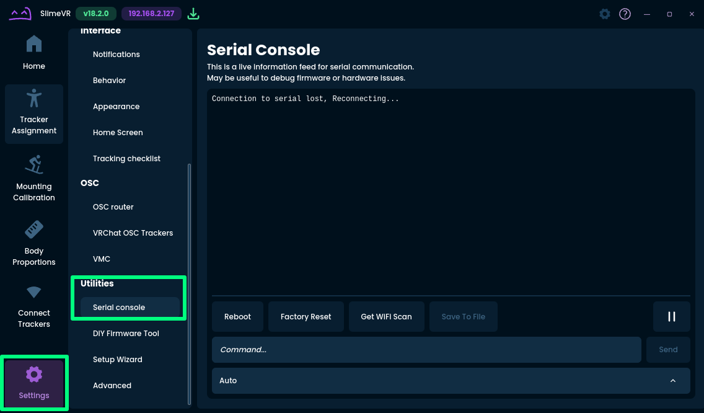

# Pairing SlimeVR ESPNOW Trackers

This page will guide you through the "slimevr-esp-dongle-manager" program and go through the pairing procedure to connect your trackers to the dongle.

## Table of Contents

- TOC
{:toc}

## Pre-requisites Check

By now, you should have the following prepared:
* "slimevr-esp-dongle-manager" program is installed on your computer. If not, go to the [Pre-requisites](./00-Prerequisites.md) step.
* The ESPNOW Tracker firmware has been flashed to your SlimeVR trackers. If not, go to the [Flashing Tracker and Dongle](./01-Flashing-Tracker-and-Dongle.md) step.
* The ESPNOW Receiver firmware has been flashed to your dongle. If not, go to the [Flashing Tracker and Dongle](./01-Flashing-Tracker-and-Dongle.md) step.

You should also have the SlimeVR Server installed.

## Introduction to SlimeVR ESP Dongle Manager

The SlimeVR ESP Dongle Manager provides a graphical interface to manage your dongle and trackers. The picture above demonstrates the available buttons once a dongle is plugged in. These will be the buttons used in order to allow for pairing trackers to the dongle.

## Serial Console

The SlimeVR serial console will also be used to manage sending commands to the tracker. In the SlimeVR Server, navigate through the menu on the left side:  
`Settings -> Utilities -> Serial Console`

Here, you will see a text box "Command..." and a drop down that by default says "Auto". You can select a device to communicate with through the dropdown. After selecting a device from the dropdown, you can type in text within the "Command..." text box and press the send button to send commands to the device.

## Preparing the Dongle and Tracker

Plug in the dongle to your computer via a USB cable. If your dongle uses one port, connect that to the computer. If your dongle has two ports, examine the underside of the dongle and check if under one of the ports it says "USB". Connect the port with the "USB" text into your computer.

TODO: Insert two pictures of a 1 usb and 2 usb port dongle

Once you plug in your dongle, you should see a SlimeVR icon appear on the top left area of the window after connecting your dongle. Select it and press the "Connect" button below. You should see a set of buttons afterwards. 

In order to optimize the tracking quality, you will need to do a scan of your wireless environment to select the channel, which is where data will be transmitted. Locate and press the "Scan Wireless Environment" button. A new pop-up will appear to show the scan process. Once it is complete, it will auto select the channel with the lowest activity. Confirm by pressing the button below to set the channel.

You will also need to plug in your tracker to your computer as well to pair them. Ensure that in the Serial Console window within SlimeVR, you start seeing text that contains "`[ESPNow]`". If not, you may want to consult the [Common Issues](https://docs.slimevr.dev/common-issues.html) page.

## Pairing Trackers to the Dongle

In order for the SlimeVR Server to receive tracker data, you must pair all trackers to the dongle. In the SlimeVR ESP Dongle Manager, make sure your dongle is selected and connected.

To begin pairing, press the "Enter Pairing Mode" button. You should see in the right side the text "`[CMD] Pairing mode enabled.`"

Within 60 seconds, go to the SlimeVR Server application in the serial console and type in the "Commands..." textbox "`pair`". After this, press enter on your keyboard or use the mouse to click on the "Send button". If everything is working, you should eventually see text on the SlimeVR serial console the text "`[ESPNow] Successfully paired with gateway, establishing connection...`". This confirms your tracker is now connected to your dongle.

Repeat the pairing process for every tracker you plan on using with the dongle.

After you pair all trackers, you should see your paired tracker in the SlimeVR ESP Dongle Manager on the left side, each denoted with a number. You can now test the dongle connection by going to the SlimeVR Server application and pressing the Home button on the left side. Verify that tracker activity occurs on the server when you move the tracker.

You are now ready to continue with assigning trackers as usual and setup SlimeVR for full body tracking!

